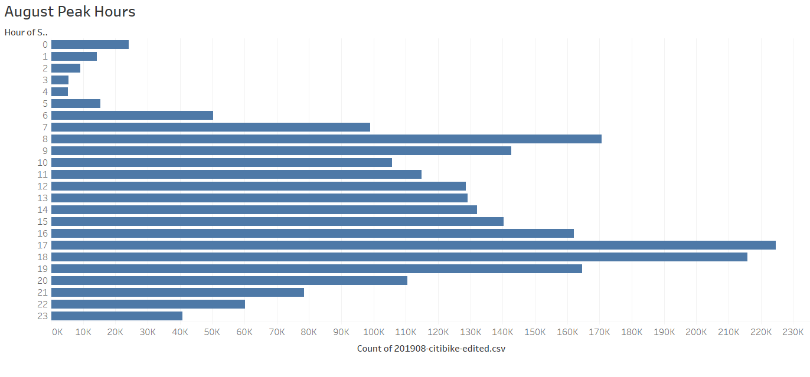
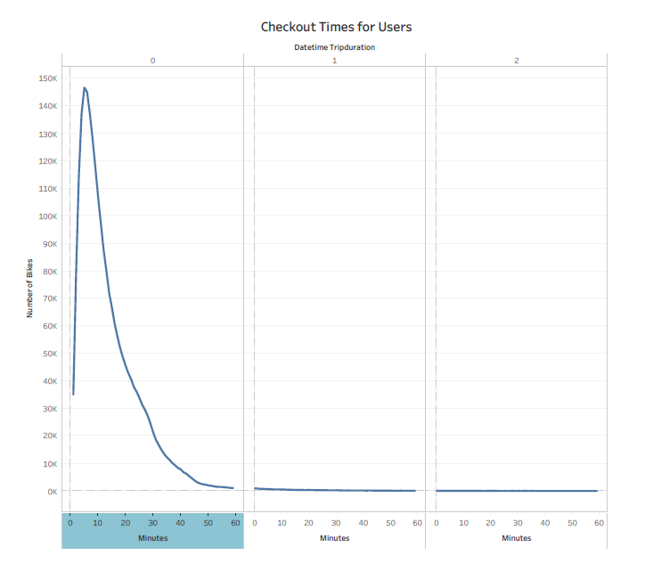
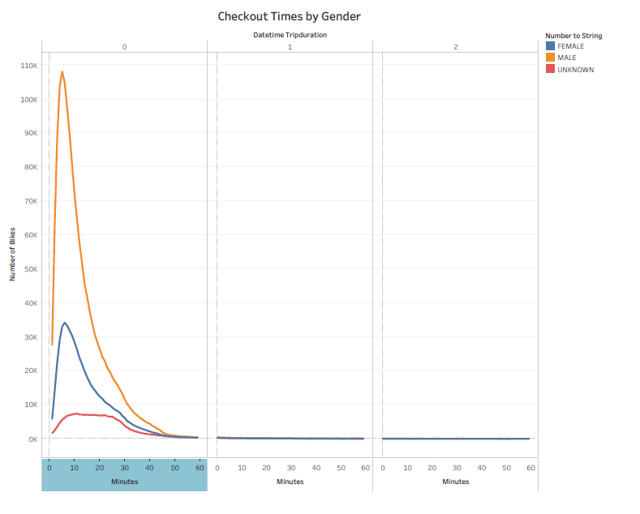
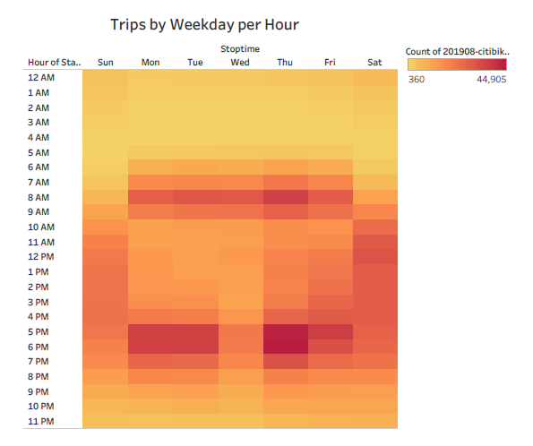
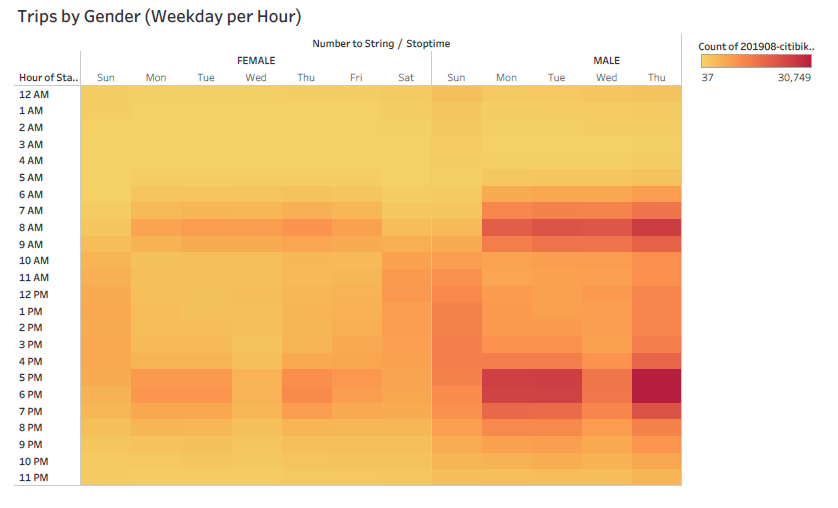
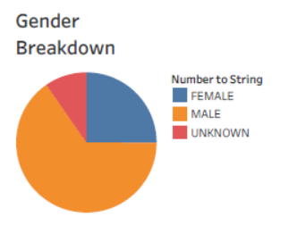
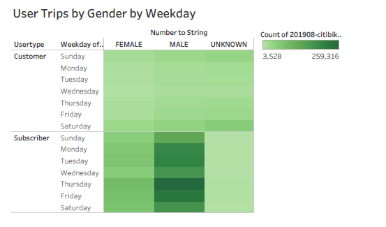

# Bikesharing Business Proposal

## Overview of Analysis

This analysis aims to make a business case for a Citibikes program in Des Moines, Iowa by providing an overview of the Citibike trends in New York City. Using the information from the New York City Citibikes program, we can uncover key takeaways that will inform the launching of a successful sister program in Des Moines.

See the full Tableau Story here:

[link to dashboard](https://public.tableau.com/shared/TM9GC7STT?:display_count=n&:origin=viz_share_link "link to dashboard")

## Results

This graph displays the distribution of ride start times over the course of a day and includes all of the August data. Based on the distribution visualized in the bar graph we can infer 1) that the bikes are used primarily in the day time and 2) that the bikes are commonly used for commuting, based on the spikes at 8am and 5pm. The commuting trend is definitely a marketing opportunity and a positive incentive for regular bike users to become subscribers.

This visualization displays the distribution of the length of time that bikes were checked out during August. The large majority of rides last about five minutes, and very few rides last over an hour. This may imply that the bikes are primarily used to get from point A to point B rather than being used for longer, leisurely rides. As a result, it may be strategic to focus on the functionality of Citibikes when advertising to the Des Moines community. 

This graph displays the check out times once again, but shows the trends based on gender. The graph reveals that the check out time trends are the same amongst men and women. We also begin to see the trend that men seem to make up a higher proportion of bike users.

This visualization provides another good representation of peak bike usage, this time showing us the detail for each day of the week. The graph confirms our observation from the first bar chart that the bikes are used by commuters during weekdays, as use is focused densely on morning and evening commuting hours. During weekend days we see that use is more dispersed throughout the day, with apparently heavier use on Saturday than on Sunday. An interesting anomaly appears on Wednesday evenings when it seems that there are less commuters than other weekdays. It may be interesting to look into this to see if there is any significance in this pattern that might be transferable to Des Moines.

This graph reveals the same information as the one above it, but again provides the detail of looking into trends by gender. Similarly to what was observed in the ride length graphs, this graph shows that ride tendencies among men and women seem to follow the same patterns. However we once again see that men appear to account for more bike rides than women.

This pie chart confirms what the graphs above have been suggesting - men make up over 50% of bike riders. It will be interesting to see if this trend will stay true in Des Moines and brings up the question of how to better advertise the bike option to women.

This graph provides a useful summary of the information that has been visualized in some of the charts above, showing us that male subscribers make up the largest demographic of bike users. It is interesting to note that within this demographic, Thursday seems to be the day with the heaviest bike usage. 

## Summary

In summary, these graphs provide important information about the trends in Citibike usage in New York City, illuminating both when bikes are used and by who. This information allows us to infer how citibikes fit into people's lifestyles and allows us to make informed assumptions about how bikes will be used in Des Moines. It also opens up questions about how we can make citibikes useful and attractive to demographics that are not currently using them. In New York City, it appears that citibikes are a popular way to commute, primarily among young men. We may be able to assume that this would be the case in Des Moines as well, and push us to strategize how we can make the bikes more attractive to female users as well.

When continuing our research into the New York City data, it would be interesting to create maps comparing the most popular start locations to the most popular end locations. Furthermore, it would be interesting to see how the start and end locations during the weekdays compare to weekend days. These visualizatoins could potentially further confirm our commuting hypothsis as well as reveal further trends.

