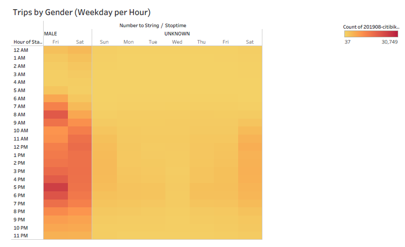

# Bikesharing Business Proposal

## Overview of Analysis

This analysis aims to make a business case for a Citibikes program in Des Moines, Iowa by providing an overview of the Citibike trends in New York City. Using the information from the New York City Citibikes program, we can uncover key takeaways that will inform the launching of a successful sister prgram in Des Moines.

## Results

## Summary
